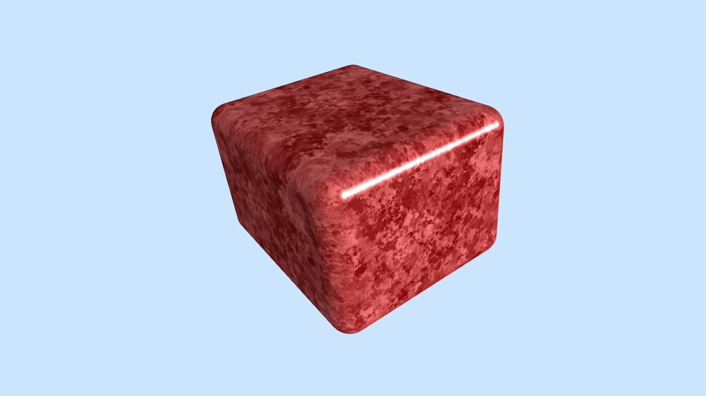

# Rounded box

Generates a rounded box mesh centered on the origin with configurable dimensions, corner and edge radius, and resolution.

<p align="center">
  
</p>

[Live Demo](https://wwwtyro.github.io/rounded-box)

## Installation

```sh
npm i rounded-box
```

## Example

```
import { generateRoundedBox } from "rounded-box";

const box = generateRoundedBox({ width: 1, height: 1.25, depth: 1.5 });
```

## API

```ts
const box = generateRoundedBox(options?: Options)
```

### Parameters

> options

| Option     | Type   | Default | Description                                                                               |
| ---------- | ------ | ------- | ----------------------------------------------------------------------------------------- |
| width      | number | 1       | The size of the box along the x-axis.                                                     |
| height     | number | 1       | The size of the box along the y-axis.                                                     |
| depth      | number | 1       | The size of the box along the z-axis.                                                     |
| radius     | number | 0.125   | The radius of the rounded box corners and edges.                                          |
| resolution | number | 5       | The number of segments along the rounded regions of the mesh used to approximate a curve. |

### Returns

> box

| Name      | Type       | Description                                                                      |
| --------- | ---------- | -------------------------------------------------------------------------------- |
| positions | number[][] | The position of each vertex in the format [[x0, y0, z0], [x1, y1, z1], ...]      |
| normals   | number[][] | The normal vector of each vertex in the format [[x0, y0, z0], [x1, y1, z1], ...] |
| cells     | number[][] | The indicies of the mesh in the format [[i0, j0, k0], [i1, j1, k1], ...]         |

## Running the example

```sh
git clone https://github.com/wwwtyro/rounded-box.git
cd rounded-box
npm i
npm run dev
```

Open a browser to localhost:3000/example/
